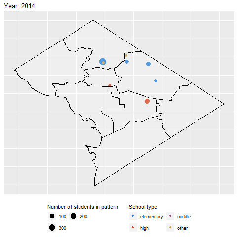
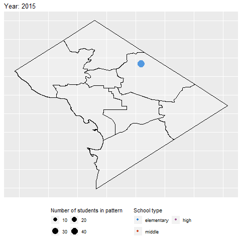
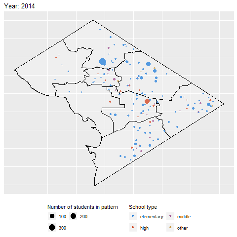
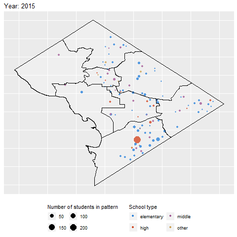
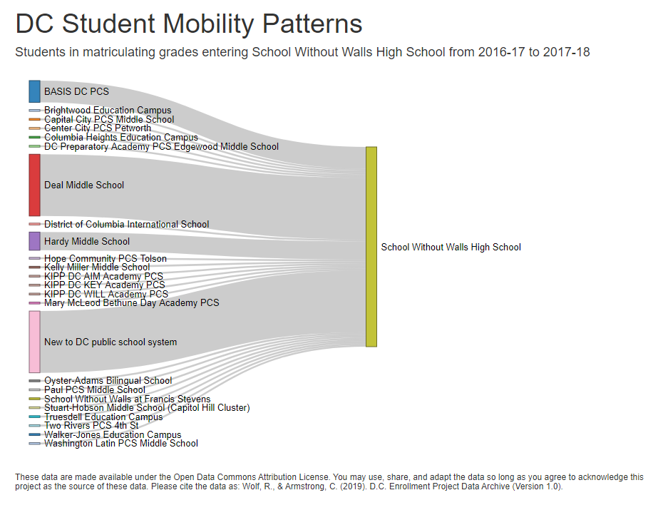

# DC-Enrollment-Study

The [Office of the District of Columbia Auditor (ODCA)](http://dcauditor.org/) contracted with the [Center for Research and Reform in Education (CRRE)](https://education.jhu.edu/crre/) at [Johns Hopkins University (JHU)](https://www.jhu.edu/) to conduct a study of the errors in enrollment projections for DC public schools and to explore potential correlates of projection errors. CRRE is a research center affiliated with JHU’s School of Education that specializes in education program evaluations in K–12. 

A [recent report commissioned by the Office of the District of Columbia Auditor](http://dcauditor.org/report/a-study-of-enrollment-projections-for-d-c-s-public-schools-assuring-accuracy-and-transparency/) examined the accuracy of enrollment projections by the District of Columbia Public Schools (DCPS) and by charter local educational agencies (LEAs).  While the report found that enrollment projections were fairly consistent with LEA level enrollment, based on a sum of October-audited school enrollments, the report found inaccuracies in school-level enrollment projections. More specifically, less than 40 percent of school-level enrollment projections were within two percentage points above or below the projection. Importantly, the report found that errors in school-level enrollment projections were greater in certain Wards, in transition grades, and in schools with more student mobility or “churn.” 

The prior report did not look comprehensively at how factors such as student mobility and school demand—both of which affect a school’s enrollment and therefore its funding—related to the accuracy of enrollment projections. In addition, the prior report did not address the accuracy of enrollment projections for specific student subgroups that receive additional funding in the District’s Uniform Per Student Funding Formula (UPSFF). 

This study provides a more robust investigation into the relationship between enrollment projection accuracy and factors that likely influence the accuracy of projections. Additionally, this study seeks to better understand the accuracy of enrollment projections for specific student subgroups that receive additional funding: special education, English learner, and students considered to be “at-risk.” In the District, the “at-risk” classification includes students in families qualifying for the Supplemental Nutrition Assistance Program (SNAP) or Temporary Assistance for Needy Families (TANF) program and students who are homeless, in foster care, or over-age for their grade in high school.  

## What's Included Here

This folder includes public use datasets, animations, and dashboards created for this project. 

## License to Use These Data

These data are made available under the [Open Data Commons Attribution License](http://opendatacommons.org/licenses/by/). You may use, share, and adapt the data so long as you agree to acknowledge this project as the source of these data. Please cite the data as:

Wolf, R., & Armstrong, C. (2019). D.C. Enrollment Project Data Archive (Version 1.0). https://github.com/betsyjwolf/DC-Enrollment-Study

### Animations Showing School Movement Before New Schools and After Closed Schools
```
Where students attended schools in 2015 after their school was closed in 2014. 
```

```
Where students attended schools in 2016 after their school was closed in 2015. 
```

```
Where students previously attended schools in 2014 before attending a new school in 2015.
```

```
Where students previously attended schools in 2014 before attending a new school in 2016. 
```


### Dashboard of School Mobility Patterns of Students in D.C. from 2014-15 through 2017-18

This [dashboard](https://jhu-crre.shinyapps.io/dc-student-mobility-patterns/) shows the patterns in how students moved across schools between consecutive school years from the 2014–15 to 2017–18 school years. The data are available for each school and can be disaggregated by students in matriculating or non-matriculating grades. Students were flagged as being in a matriculating grade if they were in the last grade that the school offered in a given school year. Below is an example of one school's mobility patterns.



### List of Public Use Datasets Produced for this Project

Only non-personally identifiable and aggregate data are released. Additionally, if the data aggregations resulted in counts or percentages based on less than 10 students, the value was replaced with “N<10.” 

```
School demand:
```
- [Lottery system](Datasets/lottery_system_v1.xlsx): By year and grade, average number of schools applied to in the lottery as well as number of students applying in the lottery each year.
- [Lottery school](Datasets/lottery_school_v1.xlsx): By school and year and grade, number of students who ranked school #1, #2, #3, etc. in the lottery and number of students who listed the school in their lottery application at any rank or listed the school as one of their top three choices. Also includes seats offered, enrollment, waitlist length, and waitlist offers made by June, August, and October, and lottery preferences available for the school.
- [In-boundary system](Datasets/inboundary_system_v1.xlsx): By student subgroup and year, the in-boundary capture rate and DCPS by-right capture rate. Note this file contains only DCPS in-boundary schools. By-right was determined by feeder patterns and enrollment in the school in the previous year. 
- [In-boundary school](Datasets/lottery_school_v1.xlsx): By school and year, the DCPS in-boundary capture rate, the percent of students attending the school who were in-boundary, and the number of students living in the boundary who were in the public school system. Note this file contains only DCPS in-boundary schools.
```
School mobility:
```
- [School mobility rates](Datasets/school_mobility_rates_v1.xlsx): By school and consecutive years, the numbers of students enrolled, matriculated, remained in the school, switched schools, or left the public school system from one year to the next. We also calculated the between-year mobility and retention rates. Additionally, mid-year mobility rates were calculated from OSSE school report card data for the 2017-18 school year only. 
- [Sector patterns](Datasets/sector_patterns_v1.xlsx): The sectors of schools attended for students who remained in the public school system from the 2014–15 to 2017–18 school years, overall and by subgroup. 
- [Number school patterns](Datasets/number_school_patterns_v1.xlsx): The number of schools attended for students who remained in the public school system from the 2014–15 to 2017–18 school years, overall and by subgroup. Includes for all students and students who were not flagged as matriculating from one school to another at any point during the 4-year period. 
- [Student residential and school mobility](Datasets/student_residential_mobility_v1.xlsx): By consecutive years, the numbers of students who changed home address and/or school. Overall and by student subgroup. Includes for all students and for students who did not matriculate only. 
- [Actual feeder patterns](Datasets/actual_feeder_v1.xlsx): By school and consecutive years, the counts of students who transferred from one school to the next in the following school year. Disaggregates the data for students in matriculating and non-matriculating grades. 
```
School and system demographics:
```
- [School demographics](Datasets/school_demographics_v1.xlsx): By school and year, student demographics: percent “at-risk”, ELL, special education, Black, White, Latino, female, special education and “at-risk”, special education level 1, special education levels 2/3/4. 
- [System demographics](Datasets/system_demographics_v1.xlsx): By grade, sector, and year, student demographics: percent “at-risk”, ELL, special education, Black, White, Latino, female, special education and “at-risk”, special education level 1, special education levels 2/3/4. 
```
Distance from home to school:
```
- [Distance home to school](Datasets/distance_home_to_school_v1.xlsx): By school and year, the average and standard deviation of the straight-line distance from home to school for students who attended that school. Also includes the average and standard deviation to the nearest in-boundary school for students who attended that school. If a student was in-boundary for more than one school, we selected the minimum distance to any in-boundary school.
- [Distance home to school subgroup](Datasets/distance_home_to_school_subgroup_v1.xlsx): By student subgroup and year, the average and standard deviation of the straight-line distance from home to school for public school students, overall and by student subgroup. Also disaggregates the data by students who were attending in-boundary versus charter or out-of-boundary schools. 
- [Type of school and proximity to home](Datasets/type_school_proximity_home_v1.xlsx): By student subgroup and year, the percentages of students who attended various types of schools (e.g., in-boundary DCPS, out-of-boundary or citywide DCPS, charter), disaggregated by the schools’ proximity to the students’ homes. 

```
Other:
```
- [Accuracy of enrollment projections](Datasets/accuracy_projections_v1.xlsx): By year and school, the percentage of error in enrollment projections overall, by grade, and by student subgroup. Note that subgroup projections were available for charter schools in the 2017–18 school year only. 

- [Ninth grade retention rates](Datasets/ninth_grade_retention_rates_v1.xlsx): By consecutive years and subgroup, numbers and percentage of ninth grade students who repeated the ninth grade. 

- [Kindergarten transfers](Datasets/kindergarten_transfers_v1.xlsx): By school and consecutive years, the percentage of kindergarten students who attended preschool elsewhere and returned to their in-boundary school for grade K. Note that this file contains in-boundary DCPS schools only. 

## Authors

* **Betsy Wolf, PhD** - [Faculty Profile](https://education.jhu.edu/directory/rebecca-wolf-phd/)
* **Clayton Armstrong**

## Programs and Packages Used in this Project

* Adrian A. Dragulescu and Cole Arendt (2018). xlsx: Read, Write, Format Excel 2007 and Excel 97/2000/XP/2003 Files. R package version 0.6.1. https://CRAN.R-project.org/package=xlsx

* Garrett Grolemund, Hadley Wickham (2011). Dates and Times Made Easy with lubridate. Journal of Statistical Software, 40(3), 1-25. URL http://www.jstatsoft.org/v40/i03/

* H. Wickham. ggplot2: Elegant Graphics for Data Analysis. Springer-Verlag New York, 2016.

* Hadley Wickham (2019). forcats: Tools for Working with Categorical Variables (Factors). R package version 0.4.0. https://CRAN.R-project.org/package=forcats

* Hadley Wickham (2019). stringr: Simple, Consistent Wrappers for Common String Operations. R package version 1.4.0. https://CRAN.R-project.org/package=stringr

* Hadley Wickham and Evan Miller (2019). haven: Import and Export 'SPSS', 'Stata' and 'SAS' Files. R package version 2.1.1. https://CRAN.R-project.org/package=haven

* Hadley Wickham and Jennifer Bryan (2019). readxl: Read Excel Files. R package version 1.3.1. https://CRAN.R-project.org/package=readxl

* Hadley Wickham and Lionel Henry (2019). tidyr: Easily Tidy Data with 'spread()' and 'gather()' Functions. R package version 0.8.3. https://CRAN.R-project.org/package=tidyr

* Hadley Wickham, Romain François, Lionel Henry and Kirill Müller (2019). dplyr: A Grammar of  Manipulation. R package version 0.8.3. https://CRAN.R-project.org/package=dplyr

* Haley Jeppson, Heike Hofmann, Di Cook, Hadley Wickham, (2018). ggmosaic: Mosaic Plots in the ‘ggplot2’ Framework. R package version 0.2.0. https://CRAN.R-project.org/package=ggmosaic

* J.J. Allaire, Christopher Gandrud, Kenton Russell and CJ Yetman (2017). networkD3: D3 JavaScript Network Graphs from R. R package version 0.4. https://CRAN.R-project.org/package=networkD3

* Joel Kuiper and Iain Marshall (2015). personograph: Pictographic Representation of Treatment Effects. R package version 0.1.3. https://CRAN.R-project.org/package=personograph

* R Core Team (2013). R: A language and environment for statistical computing. R Foundation for Statistical Computing, Vienna, Austria. URL http://www.R-project.org/.

* Robert J. Hijmans (2019). geosphere: Spherical Trigonometry. R package version 1.5-10. https://CRAN.R-project.org/package=geosphere

* Robert J. Hijmans (2019). raster: Geographic Data Analysis and Modeling. R package version 3.0-2. https://CRAN.R-project.org/package=raster

* Roger Bivand, Tim Keitt and Barry Rowlingson (2019). rgdal: Bindings for the 'Geospatial' Data Abstraction Library. R package version 1.4-3. https://CRAN.R-project.org/package=rgdal

* StataCorp. 2019. Stata Statistical Software: Release 16. College Station, TX: StataCorp LLC. 

* Thomas Lin Pedersen and David Robinson (2019). gganimate: A Grammar of Animated Graphics. R package version 1.0.3.

* Winston Chang, Joe Cheng, JJ Allaire, Yihui Xie and Jonathan McPherson (2019). shiny: Web Application Framework for R. R package version 1.3.2. https://CRAN.R-project.org/package=shiny


